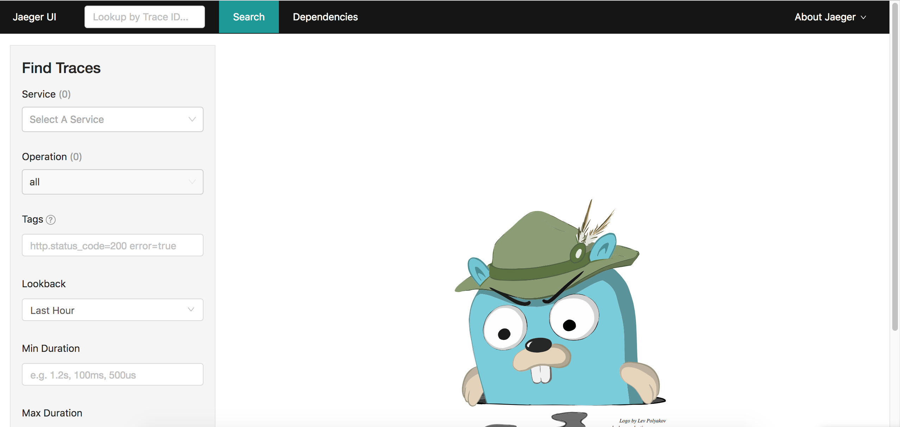
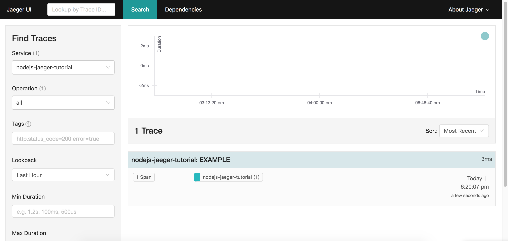
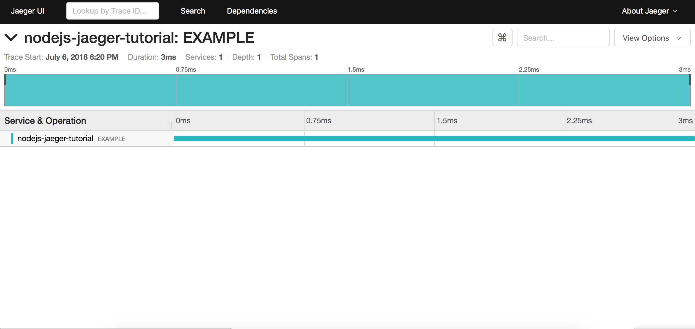

# Introduction

You've heard a great deal about microservices and how they're [killing the monolith](https://blog.risingstack.com/killing-the-monolithic-architecture). So you try it out on your next project and everything seems great. Maybe you have a gateway layer that receives HTTP requests from a web client and gets the necessary data for the response from your other services. Your services are small and easy to understand, and if you need to update one service, you can do it without touching the rest. You think to yourself "This is great! Microservices are awesome!"

But then... you notice something weird going on in your UI. "Hmm", you think to yourself, "why isn't that loading spinner going away"? So you open up your browser's debugger and see that one of your requests is returning `null` when it shouldn't be. You check the logs of your gateway layer and don't see any errors, no stack trace to help you out. You spend the next few hours debugging what's going on going service by service until you finally find the cause of the problem a few layers deep. You patch it up and everything's running smoothly again, but you're no longer so sure if microservices are all that they're made up to be.

TL;DR Microservices are great and yield several [benefits](https://dzone.com/articles/benefits-amp-examples-of-microservices-architectur), but **it's damn hard to debug issues across services**.

This guide will teach you how to tackle this issue in Node.js based microservices by using [Jaeger](https://www.jaegertracing.io/) to implement `Distributed Tracing`.

# Prerequisites

This guide assumes you have knowledge of the following technologies:

- Node.js
- Docker
- Microservices

# What is Distributed Tracing?

Distributed tracing is a methodology designed to observe and debug distributed systems. We do this by keeping track of and gathering data throughout an operation that spans multiple services.

Let's take the example I gave above. A web client makes a request to a gateway service that makes requests to other services to grab the data needed for the response. The operation, or `trace`, in this case is the HTTP request from the client. We want to keep track of it throughout each subsequent request to the other services all the way until the gateway responds.

The result should look something like this:


(courtesy of: https://www.jaegertracing.io/docs/architecture/)

What you're looking at is a high level example of a trace. A trace is made up of `spans` (represented by the horizontal bars in the image) which are essentially suboperations.

In our example, the span `A` represents the work done by the gateway service. It makes a request to two services represented by the spans `B` and `E`. The service represented by span `B` also makes two requests of it's own to two other services represented by spans `C` and `D`.

In formal terms, a trace is a Directed Acyclic Graph (DAG) of spans, where a span represents some logical piece of work done by the system.

Each span in this example would contain data useful for analyzing and debugging the trace. At the very minimum, each span service being called, an operation name, and how long the span takes to complete. However, you can also store other useful information such as status codes, URIs and error logs.

One important thing to remember, though, is that a span doesn't necessarily map one-to-one to a microservice. Spans can be used to represent any logical piece of work done by your system. This can include database calls, cron jobs, or even just some complex algorithm running as part of a request. So one microservice can create several spans of its own. It's up to you to decide what makes sense to capture in a span.

Distributed tracing has been getting popular recently because of the rise of microservices, however it's been around for a long time. As such, there's a ton of great material out there that I highly encourage you to go read once you're ready to go deeper. I'll post some recommended reads at the end of this post for you to check out, but for now, this should be enough info for you to get started.

# Why should I bother?

Ok but before you get started you might be asking yourself if it's even worth it, and that's a really good question to have! Adding distributed tracing to a project does incur some complexity, however, if you've got a good number of services communicating with each other, then that complexity may very well be worth it.

Distributed tracing will help you:

- Visualize and analyze an operation that spans multiple services.
- Find root causes of bugs in such an operation.
- Visualize what services depend on each other.
- And find bottlenecks in your system so that you can optimize performance.

# So what's Jaeger?

Jaeger is an implementation of distributed tracing that follows the [opentracing](http://opentracing.io/documentation/) standard created by some really smart guys at Uber. Read about their journey [here](https://eng.uber.com/distributed-tracing/) (it's a great read!).

It's mission is to simplify tracing by abstracting away key parts of the data collection and processing required. In practice this means that in your code you'll just create spans and add whatever data your want to them, and then let Jaeger do the heavy lifting of how to process, store, and visualize those spans.

For a good overview of how it does this I recommend reading through this page in their docs https://www.jaegertracing.io/docs/architecture. However, from the perspective of a developer focused on adding business logic to a service, I find it sufficient to have this simplified view of how Jaeger works (at least at first):

1.  Your code creates spans using one of the [jaeger client libraries](https://www.jaegertracing.io/docs/client-libraries/) and sends them to the jaeger `agent`.
2.  The jaeger agent deals with sending your spans to the jaeger `collector`.
3.  The collector deals with any processing needed and then stores it in a data store, such as cassandra.
4.  The jaeger UI gets it's data from that data store and creates visualizations of them such that they're useful to the developer.

This means, assuming the necessary infrastructure is set up, all you have to think about really is step `1` in that list.

# Set up Jaeger + example app

"Assuming the necessary infrastructure is set up" is a very big assumption. Luckily, however, it's quite easy to run all that infrastructure locally in a Docker container thanks to this useful Docker image that the Jaeger team created:

```
docker run -d --name jaeger \
  -e COLLECTOR_ZIPKIN_HTTP_PORT=9411 \
  -p 5775:5775/udp \
  -p 6831:6831/udp \
  -p 6832:6832/udp \
  -p 5778:5778 \
  -p 16686:16686 \
  -p 14268:14268 \
  -p 9411:9411 \
  jaegertracing/all-in-one:latest
```

The above docker command, from https://www.jaegertracing.io/docs/getting-started/, will run instances of the Jaeger agent, collector and UI in a docker container on your computer which will allow us to test out Jaeger right on our own machines.

So go ahead and run it in your terminal then open up a browser and go to http://localhost:16686/ to verify that it's running.

You should see something like this:


Got it? cool now let's look at how we can actually start creating spans in a sample app.

First, create a folder somewhere on your computer and navigate there in your terminal.

next run the following command

```
npm init
```

and feel free to use the default settings.

Then, install the `jaeger-client-node` package by running this command:

```
npm install --save jaeger-client
```

Great! now you should have everything necessary to start coding.

Create a javascript file and open it up in your favorite editor.
Then, go ahead and copy and paste the following snippet into that file:

```javascript
const initTracer = require("jaeger-client").initTracer;

const config = {
  serviceName: "nodejs-jaeger-tutorial",
  reporter: {
    logSpans: true,
    agentHost: "localhost",
    agentPort: 6832
  },
  sampler: {
    type: "probabilistic",
    param: 1.0
  }
};
const options = {
  tags: {
    "nodejs-jaeger-tutorial.version": "1.1.2"
  }
};

const tracer = initTracer(config, options);

const span = tracer.startSpan("EXAMPLE");

span.setTag("hello", "world");
span.log({ foo: "bar" });

console.log("do stuff...");

span.finish();
```

This script sets up an instance of a `tracer` which holds some configuration data and is used to create spans.
Then, we use it to create a span that represents an operation called `EXAMPLE`.
We then add some data to the span in form of a `tag` and a `log`.
In practice the difference between a tag and a log is that a tag should be searchable (i.e. http status code) and logs can contain more verbose information (i.e. error stack traces). You can find a spec of common tags and logs to add to spans [here](https://github.com/opentracing/specification/blob/master/semantic_conventions.md), but feel free to add anything that makes sense for your system!
Our script then goes on to log the string `do stuff...` to the console before calling `.finish()` on the span. Calling `.finish()` tells the jaeger client library that the operation has finished and that it's ready to be sent to the jaeger agent.

Go ahead and run that script and then refresh the Jaeger UI. You should see that the `Service` dropdown on the left now contains the text `nodejs-jaeger-tutorial`. Go ahead and click on the `Find Traces` button (you may have to scroll down a bit) and you should see something like the following:


go ahead and click into the box representing the trace and you should see this:


Then click into the span representing the `EXAMPLE` operation and then on the dropdowns for `Tags`, `Process`, and `Logs`. You should now see the data associated with that span.

Congrats, you've created your first span of hopefully many to come!

# Conclusion

In this post we've taken a quick look at what distributed tracing is, how it can help us observe interactions between microserves, and how to set up an extremely simple instrumented Node.js app using Jaeger.

In the next post, we'll take an existing microservice app and instrument it. This'll provide a much more real-world view into how you can actually start using Jaeger in your own microservices.

# Recommonded Reading

Looking for a deeper dive into the concepts discussed in this post? Check out these links!

- [Evolving Distributed Tracing at Uber Engineering](https://eng.uber.com/distributed-tracing/)
- [Opentracing Docs](http://opentracing.io/documentation/)
- [Jaeger Docs](https://www.jaegertracing.io/docs/)
- [Reasearch Paper on _Dapper_, Google's Distributed Tracing System](https://ai.google/research/pubs/pub36356)
